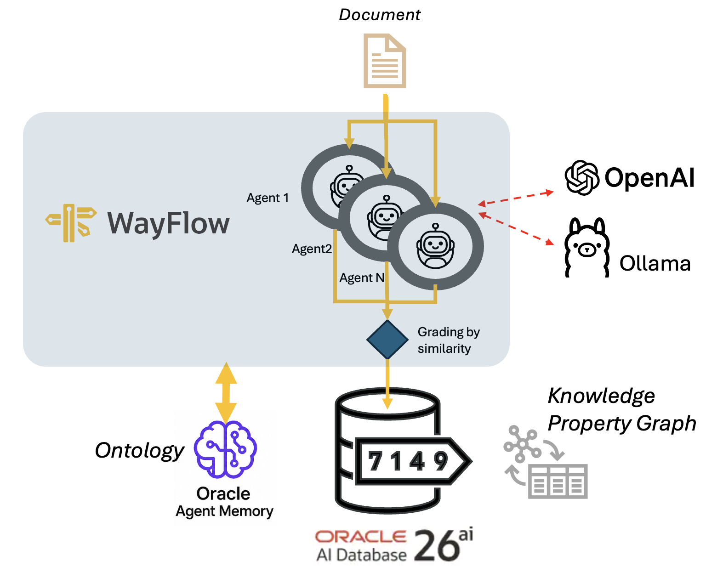
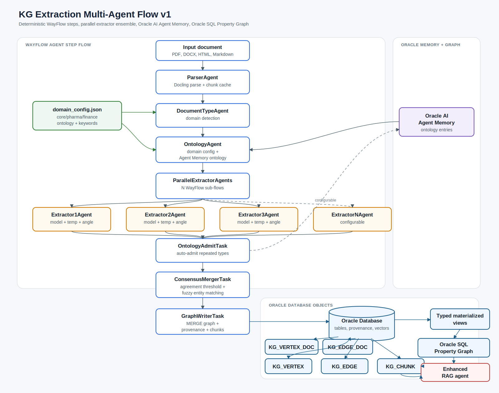
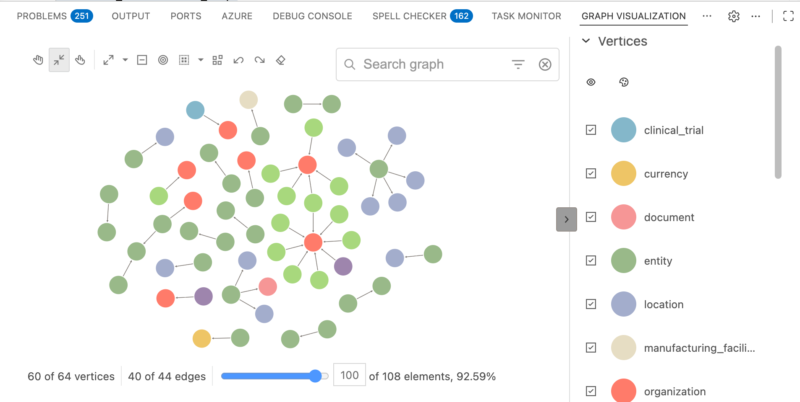

# KG Extraction Multi-Agent Flow v1



## Goal

This project builds a persistent knowledge graph from documents.

At a high level, the pipeline:

1. Parses a source document with Docling.
2. Splits the document into structured chunks.
3. Classifies the document domain, such as `core`, `pharma`, or `finance`.
4. Loads the active ontology for that domain.
5. Runs a configurable ensemble of extractor agents in parallel.
6. Keeps only triples that pass consensus.
7. Writes vertices, edges, chunks, embeddings, and provenance into Oracle Database.
8. Stores ontology entries in Oracle AI Agent Memory so the ontology can expand as new documents are processed, and used by agents exploiting the knowledge base.
9. Exposes the result as an Oracle SQL Property Graph for enhanced GraphRAG and agentic retrieval.

The design goal is not only to extract triples, but to make graph extraction more stable across runs and more useful across documents. LLM extraction is naturally variable; this system combines parallel extraction, deterministic consensus, persistent ontology memory, and Oracle-native graph storage to reduce drift and preserve decisions over time.

This architecture is described as a **multi-agent flow**. The current implementation uses a deterministic WayFlow step graph with a parallel extractor ensemble. It does not rely on autonomous handoff routing or emergent agent collaboration.

*Agents that will use the generated Knowledge Graph, will exploit the Oracle DB to navigate the Property Graph and get ontology info by Agent Memory.*

## Why These Technologies

### WayFlow

WayFlow provides the multi-agent execution structure. The current runner uses a deterministic WayFlow step graph rather than an ad hoc procedural script. Each phase has a clear role:

- `ParserAgent`
- `DocumentTypeAgent`
- `OntologyAgent`
- `ParallelExtractorAgents`
- `OntologyAdmitTask`
- `ConsensusMergerTask`
- `GraphWriterTask`

The most important WayFlow feature here is `ParallelFlowExecutionStep`: the extractor ensemble is built as N sub-flows and executed in parallel. This makes the number of extractor agents configurable without changing the orchestration code.

In other words, WayFlow is used here as a governed multi-agent workflow engine: the flow is explicit, reproducible, and easy to inspect, while the extractor ensemble still benefits from parallel execution and independent model/prompt configurations.

### Oracle AI Agent Memory

Oracle AI Agent Memory stores ontology entries as persistent memory. The ontology is not only a static JSON file; it can be expanded as new documents introduce repeated new entity or relationship types.

This gives the pipeline a useful long-term behavior:

- first documents establish the base ontology;
- later documents can propose missing types;
- repeated proposed types can be auto-admitted;
- future runs read those admitted ontology entries.

That turns the pipeline from a one-shot extractor into a learning extraction system.

### Oracle Database

Oracle Database is the durable system of record. It stores:

- document chunks;
- vertices;
- edges;
- VECTOR embeddings;
- provenance tables;
- graph metadata;
- typed materialized views;
- SQL Property Graph definitions.

Using one Oracle stack avoids splitting the system across separate graph databases, vector stores, and relational stores.

#### Oracle SQL Property Graph

Oracle SQL Property Graph provides the knowledge graph layer over the extracted vertex and edge tables. This is the graph that downstream RAG agents can query.

The graph is useful because it allows an agent to retrieve not only semantically similar chunks, but also structured relationships:

- which organization issued a security;
- which drug was tested in which clinical trial;
- which financial metric was reported for which period;
- which technology is used by which organization.

This is the core GraphRAG advantage: vector search finds relevant text, while graph traversal provides structured context and multi-hop evidence.

#### Oracle VECTOR store

Embeddings are stored directly in Oracle VECTOR columns for chunks, vertices, and edges. This enables:

- semantic chunk retrieval;
- entity similarity checks;
- near-duplicate detection;
- graph-aware retrieval over the same database objects.

### Docling

Docling gives the parser a structure-aware document layer. It handles PDFs and other document formats better than naive text splitting because it can preserve headings, tables, lists, and document layout. The pipeline then chunks that parsed content and keeps metadata for provenance.

### OpenAI-Compatible Models

OpenAI-compatible models are used for extraction and embeddings. By default the pipeline calls OpenAI directly, but `OPENAI_BASE_URL` can point to another endpoint that implements the OpenAI API shape, such as Ollama. The extractor ensemble can use one model repeated several times, or a mix of models, temperatures, and prompt angles. Embeddings are generated with the configured embedding model and stored in Oracle.

## Architecture



Let describe step-by-step the flow:

### 1. Parse

`ParserAgent` computes a SHA-256 document fingerprint, parses the file with Docling, creates chunks, and stores parsed chunks in the local chunk cache.

### 2. Classify Document Type

`DocumentTypeAgent` reads cached chunk text and compares it with the domain keywords in `domain_config.json`.

When `ONTOLOGY_DOMAINS=auto`, the active ontology is selected by keyword matching. The default domain is always included, normally `core`.

### 3. Load Ontology

`OntologyAgent` combines ontology entries from:

- `domain_config.json`;
- Oracle AI Agent Memory ontology entries;
- default fallback types when needed.

The resulting ontology is serialized and signed so extraction caches can be tied to the ontology version used for a run.

### 4. Extract In Parallel

`ParallelExtractorAgents` creates one WayFlow sub-flow per configured extractor:

- `extractor_1`
- `extractor_2`
- ...
- `extractor_N`

Each extractor receives the same document fingerprint and ontology, then calls `extract_document_triples` with its configured model, temperature, and prompt angle.

### 5. Admit Ontology Candidates

`OntologyAdmitTask` inspects extractor outputs for explicit `ontology_candidates`. Triple extraction is strict by default: triples use only the active ontology and each relationship must match an allowed source-type/target-type signature. Missing reusable schema types are proposed through the separate candidate channel. If a new type is observed at least `ONTOLOGY_AUTO_ADMIT_THRESHOLD` times and by at least `ONTOLOGY_CANDIDATE_MIN_EXTRACTORS` distinct extractors, it is saved into Oracle AI Agent Memory as an ontology entry for future documents.

Important: the current run keeps its initial ontology snapshot. Auto-admitted types are intended to affect later documents or later runs.

### 6. Consensus

`ConsensusMergerTask` groups semantically equivalent triples. A triple is accepted only if at least `CONSENSUS_MIN_AGREEMENT` distinct extractors agree.

Entity names are compared with normalization and fuzzy name similarity controlled by `CONSENSUS_NAME_SIMILARITY_THRESHOLD`.

### 7. Write Graph

`GraphWriterTask` creates or validates graph DDL, then writes:

- vertices into `KG_VERTEX`;
- edges into `KG_EDGE`;
- vertex-document provenance into `KG_VERTEX_DOC`;
- edge-document provenance into `KG_EDGE_DOC`;
- chunks into `KG_CHUNK`;
- embeddings into VECTOR columns;
- typed materialized views;
- Oracle SQL Property Graph metadata.

Writes use idempotent MERGE semantics so repeated writes update existing graph objects instead of blindly duplicating them. The graph is cumulative for a given `DB_OBJECT_PREFIX`: shared entities and relationships remain single graph elements, while document-level evidence is accumulated in provenance tables.

## Data Model

### Vertex Table

Vertices represent extracted entities. Each vertex includes:

- stable vertex id;
- canonical name;
- vertex type;
- JSON properties;
- first observed source document;
- first observed source chunk;
- confidence;
- consensus count;
- first extraction run id;
- name embedding.

When the same entity appears in later documents, the vertex remains the same graph node. Additional document and chunk evidence is stored in `KG_VERTEX_DOC`.

### Edge Table

Edges represent extracted relationships. Each edge includes:

- source vertex id;
- target vertex id;
- relationship type;
- JSON properties;
- first observed source document;
- first observed source chunk;
- confidence;
- consensus count;
- first extraction run id;
- relationship description embedding.

When the same relationship appears in later documents, the edge remains the same graph edge. Additional document and chunk evidence is stored in `KG_EDGE_DOC`.

### Provenance Tables

`KG_VERTEX_DOC` and `KG_EDGE_DOC` preserve cumulative document evidence:

- graph element id;
- document fingerprint;
- source file;
- source chunk;
- confidence;
- consensus count;
- extraction run id.

This keeps the visible graph compact while preserving which documents support each vertex and edge.

### Chunk Table

Chunks preserve source evidence. Each chunk includes:

- document fingerprint;
- source file;
- chunk index;
- chunk text;
- structural type;
- page or section metadata;
- text embedding;
- extraction run id.

### Ontology Memory

Oracle AI Agent Memory stores ontology entries such as:

```json
{
  "memory_type": "ontology_entry",
  "entry_type": "vertex_type",
  "label": "clinical_trial",
  "description": "Clinical trial or study",
  "naming_convention": "Trial identifier or official study name"
}
```

or:

```json
{
  "memory_type": "ontology_entry",
  "entry_type": "edge_type",
  "label": "tested_in",
  "source": "drug",
  "target": "clinical_trial"
}
```

## Domain Configuration

The domain model lives in `domain_config.json`.

The file contains:

- `default_domains`: domains always loaded, usually `["core"]`;
- `auto_min_keyword_matches`: global threshold for auto domain detection;
- `domains`: one object per domain;
- `keywords`: words or phrases used for detection;
- `vertex_types`: allowed entity types for that domain;
- `edge_types`: allowed relationship types for that domain.


Current domain examples:

- `core`: general entities such as person, organization, technology, concept, document, location, event.
- `pharma`: drug, clinical trial, regulatory agency, adverse event, recall, therapy area.
- `finance`: financial metric, financial statement, reporting period, account, security, filing, risk factor.


Example provided, but be free to expand with specific domains and related entities:

```json
  "pharma": {
      "description": "Pharma, biotech, clinical, manufacturing, and regulatory documents.",
      "keywords": [
        "adverse event",
        "biotech",
       ..
      ],
      "vertex_types": [
        {
          "label": "drug",
          "description": "Therapeutic drug or compound",
          "naming_convention": "Official drug or compound name"
        },
        {...
```

If an extractor sees a useful reusable type that is missing, it should emit it as `ontology_candidates`, not as a graph triple. The `OntologyAdmitTask` evaluates those candidates.

## Parameters

### Database

| Parameter | Required | Default | Description |
|---|---:|---|---|
| `ORACLE_USER` | yes | `kg_swarm_user` | Oracle Database user. |
| `ORACLE_PASSWORD` | yes | `YourPassword123` | Oracle Database password. Use a real secret in `.env`; do not commit it. |
| `ORACLE_DSN` | yes | `localhost:1521/FREEPDB1` | Oracle DSN. |
| `DB_OBJECT_PREFIX` | no | empty | Prefix for generated Oracle objects. Example: `SW_` creates `SW_KG_VERTEX`. A prefix represents one cumulative graph namespace. |
| `GRAPH_NAME` | no | `KG_EXTRACTION_GRAPH` | SQL Property Graph name. The object prefix is applied automatically. |

### OpenAI

| Parameter | Required | Default | Description |
|---|---:|---|---|
| `OPENAI_API_KEY` | yes | empty | API key for OpenAI-compatible extraction and embeddings. For local endpoints such as Ollama this can be a dummy value such as `ollama`. |
| `OPENAI_BASE_URL` | no | empty | Optional OpenAI-compatible API base URL. Leave empty for OpenAI. Example for Ollama: `http://localhost:11434/v1`. |
| `OPENAI_TIMEOUT_SECONDS` | no | `300` | Request timeout for OpenAI-compatible chat and embedding calls. Useful for local Ollama models that may otherwise appear stuck. |
| `OPENAI_MAX_RETRIES` | no | `2` | SDK retry count for OpenAI-compatible calls. Use `0` for easier debugging against local endpoints. |
| `OPENAI_EMBEDDING_MODEL` | no | `openai/text-embedding-3-large` | Embedding model used for chunks, vertices, edges, and Agent Memory. |
| `OPENAI_EMBEDDING_DIMENSIONS` | no | `3072` | VECTOR dimension used when storing embeddings in Oracle. Must match the embedding model. |

### Extractor Ensemble

| Parameter | Required | Default | Description |
|---|---:|---|---|
| `EXTRACTOR_COUNT` | no | `3` | Number of parallel extractor agents. |
| `EXTRACTOR_MODELS` | no | `gpt-4o,gpt-4o-mini,gpt-4o` | Comma-separated model list. If set, it must contain exactly `EXTRACTOR_COUNT` values. |
| `EXTRACTOR_TEMPERATURES` | no | `0.0,0.0,0.0` | Comma-separated temperature list. If set, it must contain exactly `EXTRACTOR_COUNT` numeric values. |
| `EXTRACTOR_PROMPT_ANGLES` | no | `entity_first,relationship_first,balanced` | Optional comma-separated prompt strategies. If shorter than `EXTRACTOR_COUNT`, values cycle. Allowed values: `entity_first`, `relationship_first`, `balanced`. |
| `EXTRACTION_BATCH_SIZE` | no | `30` | Number of chunks processed per extraction LLM call. |
| `EXTRACTION_STRICT_ONTOLOGY` | no | `true` | When true, triples must use only active ontology types and relationship source/target type signatures. Missing reusable types must be emitted as `ontology_candidates`, not as graph triples. |
| `EXTRACTOR_PARALLEL_WORKERS` | no | `0` | Max parallel workers for WayFlow extraction. `0` means one worker per configured extractor. |

Example with five extractors:

```env
EXTRACTOR_COUNT=5
EXTRACTOR_MODELS=gpt-4o,gpt-4o,gpt-4o-mini,gpt-4o,gpt-4o-mini
EXTRACTOR_TEMPERATURES=0.0,0.1,0.0,0.2,0.0
EXTRACTOR_PROMPT_ANGLES=entity_first,relationship_first,balanced
CONSENSUS_MIN_AGREEMENT=3
```

With this configuration, `EXTRACTOR_PROMPT_ANGLES` cycles to:

```text
extractor_1 -> entity_first
extractor_2 -> relationship_first
extractor_3 -> balanced
extractor_4 -> entity_first
extractor_5 -> relationship_first
```

### Consensus

| Parameter | Required | Default | Description |
|---|---:|---|---|
| `CONSENSUS_MIN_AGREEMENT` | no | `2` | Minimum number of distinct extractors that must agree for a triple to survive. Must be `<= EXTRACTOR_COUNT`. |
| `CONSENSUS_NAME_SIMILARITY_THRESHOLD` | no | `0.88` | Fuzzy name threshold used when grouping equivalent entity names during consensus. |

The total vote count is derived from `EXTRACTOR_COUNT`.

### Ontology And Domains

| Parameter | Required | Default | Description |
|---|---:|---|---|
| `ONTOLOGY_AUTO_ADMIT_THRESHOLD` | no | `3` | Minimum number of candidate observations before a new vertex or edge type is auto-admitted into Agent Memory. |
| `ONTOLOGY_CANDIDATE_MIN_EXTRACTORS` | no | `0` | Minimum number of distinct extractors that must propose a candidate type. `0` means use `CONSENSUS_MIN_AGREEMENT`. |
| `ONTOLOGY_DOMAINS` | no | `core` | Comma-separated domain list, or `auto` for keyword-based detection. |
| `DOMAIN_CONFIG_FILE` | no | `domain_config.json` | External domain configuration file containing keywords, vertex types, and edge types. |

### Agent Memory

| Parameter | Required | Default | Description |
|---|---:|---|---|
| `AGENT_MEMORY_SCHEMA_POLICY` | no | `CREATE_IF_NECESSARY` | Agent Memory schema lifecycle. Valid values: `CREATE_IF_EMPTY`, `CREATE_IF_NECESSARY`, `RECREATE`, `REQUIRE_EXISTING`. |
| `AGENT_MEMORY_TABLE_PREFIX` | no | derived from DB prefix | Prefix for Agent Memory managed tables. |
| `AGENT_MEMORY_ONTOLOGY_ONLY` | no | `true` | When true, Agent Memory is reserved for ontology entries. Extraction records and schema rules become no-ops. |

### Cache And Reprocessing

| Parameter | Required | Default | Description |
|---|---:|---|---|
| `FORCE_REPROCESS` | no | `0` | Set to `1` to ignore prior extraction records and process the document again. |
| `EXTRACTION_CACHE_ENABLED` | no | `true` | Saves extractor outputs locally so graph-write retries do not redo LLM extraction. |
| `EXTRACTION_CACHE_READ_ENABLED` | no | `true` | Reads saved extractor outputs. `FORCE_REPROCESS=1` bypasses cache reads even when this is true. |
| `CHUNK_CACHE_ENABLED` | no | `true` | Enables local parsed chunk cache. |
| `CHUNK_CACHE_DIR` | no | `cache/chunks` | Directory for parsed document chunks. |
| `GRAPH_SWARM_ENV_FILE` | no | unset | Path to a specific env file. If unset, the app reads `.env` from the current directory and then the package directory. |

## Getting Started

### Requirements:

- Visual Studio Code
- Oracle SQL Developer Extension for VS Code
- Oracle AI Database version 23ai or later
- Oracle SQL Developer Graph Visualization for VS Code


### 1. Create a Python Environment

From this directory, create and activate the env:

```bash
python3 -m venv .venv
.venv/bin/python -m pip install --upgrade pip
.venv/bin/python -m pip install -r requirements.txt

source .venv/bin/activate
```

### 2. Configure Environment

Create a local `.env`:

```bash
cp .env.example .env
```

Edit `.env` and set:

```env
ORACLE_USER=your_user
ORACLE_PASSWORD=your_password
ORACLE_DSN=localhost:1521/FREEPDB1
OPENAI_API_KEY=your_openai_api_key
OPENAI_BASE_URL=https://api.openai.com/v1
```

For Ollama, expose its OpenAI-compatible endpoint and use local model names:

```env
OPENAI_API_KEY=ollama
OPENAI_BASE_URL=http://localhost:11434/v1
OPENAI_TIMEOUT_SECONDS=300
OPENAI_MAX_RETRIES=0
EXTRACTOR_MODELS=llama3.1,llama3.1,llama3.1
OPENAI_EMBEDDING_MODEL=nomic-embed-text
OPENAI_EMBEDDING_DIMENSIONS=768
```

Then choose the extractor ensemble:

```env
EXTRACTOR_COUNT=3
EXTRACTOR_MODELS=gpt-4o,gpt-4o-mini,gpt-4o
EXTRACTOR_TEMPERATURES=0.0,0.0,0.0
EXTRACTOR_PROMPT_ANGLES=entity_first,relationship_first,balanced
CONSENSUS_MIN_AGREEMENT=2
```

### 3. Configure Domains

Use the included `domain_config.json`, or create another domain file and point to it:

```env
ONTOLOGY_DOMAINS=auto
DOMAIN_CONFIG_FILE=domain_config.json
```

For a known domain, you can force it:

```env
ONTOLOGY_DOMAINS=core,finance
```

or:

```env
ONTOLOGY_DOMAINS=core,pharma
```

### 4. Run The Pipeline

From inside this directory:

```bash
.venv/bin/python -m runner graphrag_example.pdf
```

Process multiple documents:

```bash
.venv/bin/python -m runner doc1.pdf doc2.pdf doc3.pdf
```

Force a document to run again:

```bash
FORCE_REPROCESS=1 .venv/bin/python -m runner graphrag_example.pdf
```


## Running Example

If you want clean the schema/graph created by previous knowledge graph extractions running, use this utility provided changing the `PREFIX` name, for example `SW1_`:

```bash
.venv/bin/python cleanup_schema.py --schema-prefix [PREFIX] --yes
```

### Input

Assume an example document like `acme_financial_report.pdf` contains statements such as:

```text
ACME Corp reported revenue of 120 million USD for FY2025.
The annual report states that net income increased during Q4 2025.
ACME Corp issued senior notes to refinance existing debt.
```

With:

```env
ONTOLOGY_DOMAINS=auto
EXTRACTOR_COUNT=3
EXTRACTOR_MODELS=gpt-4o,gpt-4o-mini,gpt-4o
EXTRACTOR_TEMPERATURES=0.0,0.0,0.0
EXTRACTOR_PROMPT_ANGLES=entity_first,relationship_first,balanced
CONSENSUS_MIN_AGREEMENT=2
```

Run:

```bash
.venv/bin/python -m runner acme_financial_report.pdf
```

### Representative Runtime Log

```text
=== KG Extraction Pipeline ===
Run ID: run_20260605_101530_a1b2c3
Database: localhost:1521/FREEPDB1

Connecting to Oracle Database...
Initializing Agent Memory...
Agent Memory schema policy: CREATE_IF_NECESSARY
Checking ontology registry...
Setting up tools...
============================================================
Processing: acme_financial_report.pdf
============================================================
Executing WayFlow agent step flow...
Parsing document...
[runner] document type evaluated; type=finance, domains=core,finance
[runner] ontology loaded; domains=core,finance, entity_types=17, relationship_types=22
[runner] extractor extractor_1 started; model=gpt-4o, batch_size=30
[runner] extractor extractor_2 started; model=gpt-4o-mini, batch_size=30
[runner] extractor extractor_3 started; model=gpt-4o, batch_size=30
[runner] extractor extractor_1 completed; triples=18
[runner] extractor extractor_2 completed; triples=15
[runner] extractor extractor_3 completed; triples=17
[runner] consensus completed; accepted=11, raw_triples=50
[graphwriter] creating/validating typed graph DDL
[runner] graph write completed; {'vertices_created': 9, 'vertices_updated': 2, 'edges_written': 11, 'chunks_stored': 6, 'consensus_rate': 0.22}
```

### Representative Output

The runner prints a JSON result similar to:

```json
{
  "skipped": false,
  "manifest": {
    "filename": "acme_financial_report.pdf",
    "doc_fingerprint": "2a4f...b91c",
    "chunk_count": 6
  },
  "ontology_domains": ["core", "finance"],
  "ontology_domain_report": {
    "mode": "auto",
    "document_type": "finance",
    "scores": {
      "pharma": 0,
      "finance": 8
    },
    "matched_keywords": {
      "finance": ["annual report", "debt", "net income", "revenue"]
    }
  },
  "extractors": {
    "extractor_1": {
      "triples": 18,
      "batches": 1,
      "chunks": 6
    },
    "extractor_2": {
      "triples": 15,
      "batches": 1,
      "chunks": 6
    },
    "extractor_3": {
      "triples": 17,
      "batches": 1,
      "chunks": 6
    }
  },
  "raw_triples": 50,
  "consensus_triples": 11,
  "ontology_updates": {
    "vertices": [],
    "edges": [],
    "candidate_vertices": [],
    "candidate_edges": [],
    "ambiguous_pending_types": {},
    "rejected_candidates": {}
  },
  "write_report": {
    "vertices_created": 9,
    "vertices_updated": 2,
    "edges_written": 11,
    "chunks_stored": 6,
    "consensus_rate": 0.22
  }
}
```

### Example Accepted Triples

The graph write step would turn accepted triples into vertices and edges such as:

```text
organization:acme_corp
  reports_metric -> financial_metric:revenue

financial_metric:revenue
  reported_for_period -> reporting_period:fy2025

organization:acme_corp
  issues_security -> security:senior_notes

financial_metric:net_income
  reported_for_period -> reporting_period:q4_2025
```

These become rows in Oracle and typed labels in the SQL Property Graph.

### Query The Graph

SQL Developer Graph Visualization expects a `GRAPH_TABLE` query. Run this query for all visible graph edges:

```sql
SELECT
  id_src,
  id_e,
  id_dst,
  source_name,
  source_type,
  edge_label,
  target_name,
  target_type
FROM GRAPH_TABLE (
  SW1_KG_EXTRACTION_GRAPH
  MATCH (src)-[e]->(dst)
  COLUMNS (
    VERTEX_ID(src) AS id_src,
    EDGE_ID(e) AS id_e,
    VERTEX_ID(dst) AS id_dst,
    src.canonical_name AS source_name,
    src.vertex_type AS source_type,
    e.relationship_type AS edge_label,
    dst.canonical_name AS target_name,
    dst.vertex_type AS target_type
  )
)
```

Change the graph name to match the active prefix, if SW2_ for example, in: `SW2_KG_EXTRACTION_GRAPH`.

In VS Code, with Oracle SQL Developer Extension for VS Code
and Oracle SQL Developer Graph Visualization for VS Code installed as plugins:
you'll see something like:



To inspect cumulative document evidence for vertices:

```sql
SELECT
  v.canonical_name,
  v.vertex_type,
  vd.source_doc,
  vd.source_chunk,
  vd.consensus_count,
  vd.extraction_run
FROM SW1_KG_VERTEX v
JOIN SW1_KG_VERTEX_DOC vd
  ON vd.vertex_id = v.vertex_id
ORDER BY v.vertex_type, v.canonical_name, vd.source_doc, vd.source_chunk
```

To inspect cumulative document evidence for edges:

```sql
SELECT
  src.canonical_name AS source_name,
  e.relationship_type,
  dst.canonical_name AS target_name,
  ed.source_doc,
  ed.source_chunk,
  ed.consensus_count,
  ed.extraction_run
FROM SW1_KG_EDGE e
JOIN SW1_KG_VERTEX src
  ON src.vertex_id = e.source_vertex_id
JOIN SW1_KG_VERTEX dst
  ON dst.vertex_id = e.target_vertex_id
JOIN SW1_KG_EDGE_DOC ed
  ON ed.edge_id = e.edge_id
ORDER BY e.relationship_type, source_name, target_name, ed.source_doc, ed.source_chunk
```

## Operational Notes

- Use a disposable `DB_OBJECT_PREFIX` such as `DEV_` or `SW_TEST_` when testing schema changes.
- Reuse the same `DB_OBJECT_PREFIX` when you want one cumulative multi-document graph. Change `DB_OBJECT_PREFIX` when you want an isolated graph namespace for comparison or testing.
- `AGENT_MEMORY_SCHEMA_POLICY=RECREATE` can wipe Agent Memory objects. Use it carefully.
- Changing `OPENAI_EMBEDDING_DIMENSIONS` or `DB_OBJECT_PREFIX` can require fresh Oracle objects.
- Changing `EXTRACTOR_COUNT`, model lists, or prompt angles changes extraction cache identity.
- Old cache files named with previous extractor names such as `alpha`, `beta`, or `gamma` will not be reused by the newer `extractor_1`, `extractor_2`, ... naming scheme.
- `FORCE_REPROCESS=1` is the right mode for independent run comparisons: it bypasses both extraction-record skipping and extraction-cache reads, while still allowing fresh extractor outputs to be saved.
- For true 9-vote consensus, configure `EXTRACTOR_COUNT=9` and run one consensus over all 9 extractor outputs. Running 3 extractors 3 separate times only becomes equivalent if all 9 raw outputs are combined before consensus and caches do not collapse repeated calls into reused results.

## Summary

This v1 design is an Oracle-native, memory-aware, parallel-extractor graph extraction system.

WayFlow gives the pipeline a clear multi-agent structure and parallel extractor execution. Oracle AI Agent Memory gives the ontology continuity across documents. Oracle Database stores the operational data, vectors, chunks, and graph objects in one place. Oracle SQL Property Graph turns extracted triples into a queryable knowledge graph. Together, these pieces create a stronger foundation for GraphRAG agents than either vector retrieval or one-shot LLM extraction alone.
